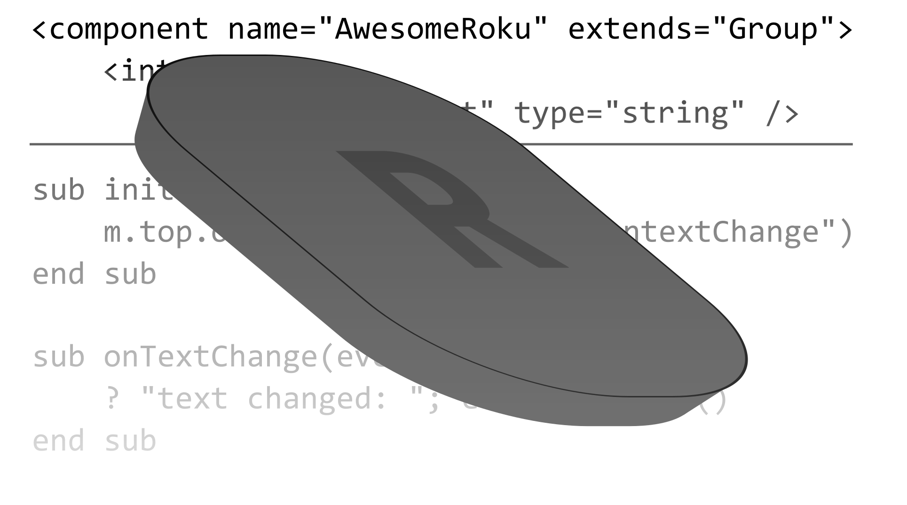

Join the Roku Community on  

# Awesome Roku

a home for Roku, Brightscript, and SceneGraph resources

- [Awesome Roku](#awesome-roku)
  - [Documentation](#documentation)
  - [Official Development Tools](#official-development-tools)
  - [Editor Extensions](#editor-extensions)
  - [Linters](#linters)
  - [Build Tools](#build-tools)
  - [Testing](#testing)
  - [Frameworks](#frameworks)
  - [Libraries](#libraries)
    - [Community](#community)
    - [Vendors](#vendors)

## Documentation

[Official Documentation](https://developer.roku.com/docs/developer-program/getting-started/roku-dev-prog.md) - Developer guides, SceneGraph and Brightscript reference  
[Channel Certification](https://developer.roku.com/docs/developer-program/certification/certification.md) - Requirements for your channel submition

## Official Development Tools

[Roku Developer Tools Home](https://devtools.web.roku.com/) - Home page for all Roku supported tools

- [Remote Tool](http://devtools.web.roku.com/RokuRemote/) - Control a roku over local network
- [Deep Link Tester](https://devtools.web.roku.com/#deep-linking-tool) - Test Deep Linking
- [Stream Tester](https://devtools.web.roku.com/#stream-tester-tool) - Test Streams
- [Brightscript Profiler](https://devtools.web.roku.com/#brs-profiler-tool) - Navigate profiling sessions
- [Advanced Layout Editor (RALE)](https://devtools.web.roku.com/#rale-tool) - Element inspector for your Roku channel
- [Unit Test Framework](https://devtools.web.roku.com/#unit-test-framework-tool) - Write Unit tests for Brightscript and Scenegraph components
- [State Channel Analysis](https://devtools.web.roku.com/#static-channel-analysis-tool) - Like a linter for the certification checklist
- [SceneGraph Developer Extensions](https://devtools.web.roku.com/#scene-graph-developer-extensions) - Library of Roku supported components and patterns
- [Roku Channel Automation](https://devtools.web.roku.com/#roku-channel-automation) - Automation server using the ECP standard

## Editor Extensions

[vscode-brightscript-language](https://github.com/rokucommunity/vscode-brightscript-language) - VSCode extension with awesome support for Brightscript and SceneGraph  
[zeplin-roku](https://github.com/slheavner/zeplin-roku) - An extension for generating simple SceneGraph components from zeplin designs

## Linters

[eslint-plugin-roku](https://github.com/RokuRoad/eslint-plugin-roku) - eslint plugin for linting brightscript files  
[Wist](https://willowtreeapps.github.io/wist/) - A linter for brightscript  
[scenegraph-schema](https://github.com/slheavner/scenegraph-schema) - A tool to generate an xml schema for a SceneGraph project to work with xml validation extensions

## Build Tools

[brighterscript](https://github.com/rokucommunity/brighterscript) - A superset of Roku's BrightScript language. Compiles to standard BrightScript.  
[Ukor](https://github.com/willowtreeapps/ukor) - A build tool for Roku projects  
[burp](https://github.com/georgejecook/burp) - Script processing utility for Roku brightscript projects  
[sjbarag/brs](https://github.com/sjbarag/brs) - An interpreter for the BrightScript language that runs on non-Roku platforms. (\*not really a build tool but it fits here best)  
[rounded-rect-9patch](https://github.com/slheavner/rounded-rect-9patch) - CLI for generating rounded rectangle 9patches, create with Roku in mind  
[brighterscript-formatter](https://github.com/RokuCommunity/brighterscript-formatter) - A code formatter for BrighterScript (and BrightScript)  
[roku-deploy](https://github.com/rokucommunity/roku-deploy) - An npm module for zipping and deploying to Roku devices.

## Testing

[Unit Test Framework](https://devtools.web.roku.com/#unit-test-framework-tool) - Write Unit tests for Brightscript and Scenegraph components  
[Rooibos](https://github.com/georgejecook/rooibos) - simple, flexible, fun brightscript test framework for roku scenegraph apps; includes code-coverage, paremeterized testing, stubs, mocks and more  
[Roku Channel Automation](https://devtools.web.roku.com/#roku-channel-automation) - Automation server using the ECP standard  
[Rokul Runnings](https://github.com/willowtreeapps/rokul-runnings) - a client TypeScript/Javascript library UI Automation, using the ECP standard, standalone.

## Frameworks

[maestro](https://github.com/georgejecook/maestro) - A development platform for building roku channels in brighterscript in a hyper efficient and maintainable way, by leveraging brighterscript, and MVVM binding syntax, similar to Flex, Xamarin and Angular frameworks  
[brighterscript](https://github.com/rokucommunity/brighterscript) - A superset of Roku's BrightScript language. Compiles to standard BrightScript.
[roact](https://github.com/Roblox/roact) - A React-inspired design pattern for building UI components.

## Libraries

### Community

[rLog](https://github.com/georgejecook/rLog) - Logging for Roku  
[rocute](https://github.com/willowtreeapps/rocute) - beautiful ui components for roku development

### Vendors

[SceneGraph Developer Extensions](https://devtools.web.roku.com/#scene-graph-developer-extensions) - Library of Roku supported components and patterns  
[Google IMA DAI SDK](https://developers.google.com/interactive-media-ads/docs/sdks/roku/download) - Google SDK for ads  
[Adobe Marketing Cloud Media SDK](https://github.com/Adobe-Marketing-Cloud/media-sdks/tree/master/sdks/roku) - title
